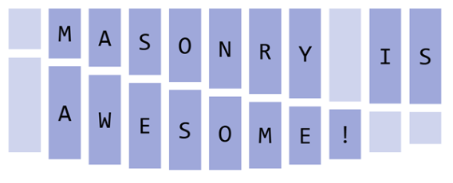
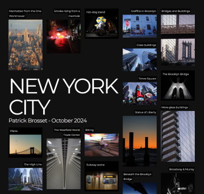
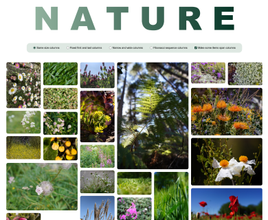
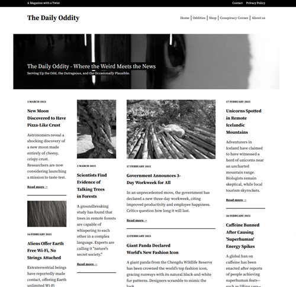

# CSS Masonry demos

This directory contains demo pages that showcase the implementation of CSS Masonry in Chromium.

## Enable Masonry support

To try the demos, first enable Masonry:

1. Use a Chromium-based browser, such as Microsoft Edge or Chrome, and make sure the version is at least 140.
1. In the browser, open a new tab and go to `about:flags`.
1. Search for "CSS Masonry Layout" in the search box.
1. Set the **CSS Masonry Layout** flag to **Enabled**, and then restart the browser.

## Demos

* [Blog](https://microsoftedge.github.io/Demos/css-masonry/blog.html)

  

* [Masonry is awesome](https://microsoftedge.github.io/Demos/css-masonry/masonry-is-awesome.html)

  

* [New York City photos](https://microsoftedge.github.io/Demos/css-masonry/new-york.html)

  

* [Nature photos with multiple layouts](https://microsoftedge.github.io/Demos/css-masonry/nature.html)

  

* [News site: The Daily Oddity](https://microsoftedge.github.io/Demos/css-masonry/the-daily-oddity.html)

  

* Masonry syntax examples:

  * [Same size columns](https://microsoftedge.github.io/Demos/css-masonry/syntax-examples/same-size-columns.html)
  * [Same size rows](https://microsoftedge.github.io/Demos/css-masonry/syntax-examples/same-size-rows.html)
  * [Default track size](https://microsoftedge.github.io/Demos/css-masonry/syntax-examples/default-track-size.html)
  * [Custom track sizes](https://microsoftedge.github.io/Demos/css-masonry/syntax-examples/custom-track-sizes.html)
  * [Masonry shorthand](https://microsoftedge.github.io/Demos/css-masonry/syntax-examples/masonry-shorthand.html)
  * [Spanning multiple tracks](https://microsoftedge.github.io/Demos/css-masonry/syntax-examples/span-multiple-tracks.html)