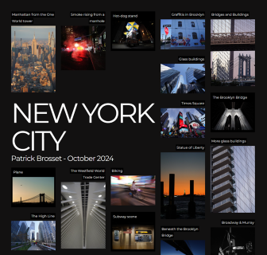
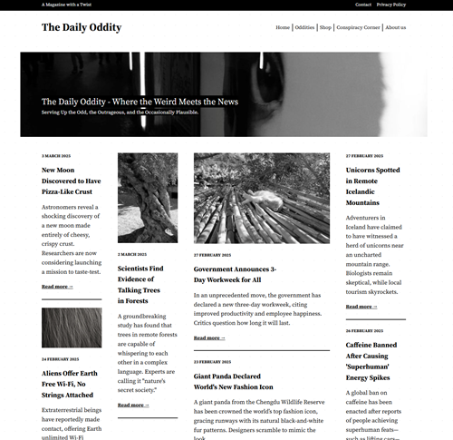
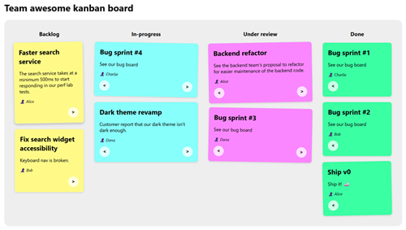
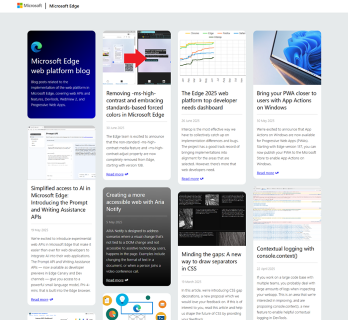
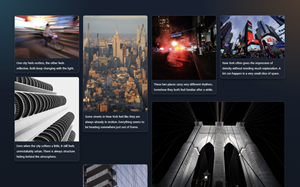
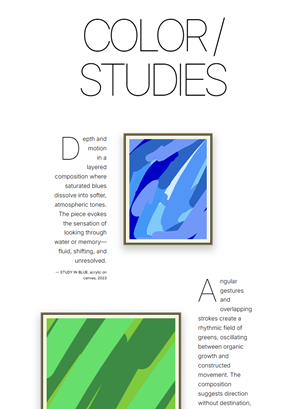
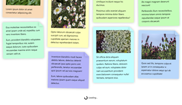
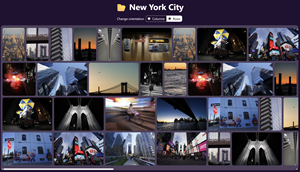

# CSS Grid Lanes samples

This directory contains sample pages showing how to use CSS Grid Lanes, also known as CSS Masonry.

<!-- ====================================================================== -->
## Enable CSS Grid Lanes support in Chromium-based browsers

To test CSS Grid Lanes in Microsoft Edge, and other Chromium-based browsers, enable the feature:

1. Use a the latest version of Microsoft Edge, or an other Chromium-based browser.

1. Open a new tab or window, and go to the `about://flags` page.

1. Enter _CSS Grid Lanes Layout_ in the **Search flags** text box, at the top of the page.

   The list of flags is filtered to only show the **CSS Grid Lanes Layout** flag.

1. Under the **CSS Masonry Layout** flag section, set the dropdown to **Enabled**.

1. Restart the browser.

<!-- ====================================================================== -->
## Samples

| Sample | Description | Screenshot |
| -- | -- | -- |
| [New York City photos](https://microsoftedge.github.io/Demos/css-masonry/new-york.html) | A photo gallery with explicit placement and lane spanning. |  |
| [News site - The Daily Oddity](https://microsoftedge.github.io/Demos/css-masonry/the-daily-oddity.html) | A news site layout with auto-placed, densely packed, articles, and column spanning. |  |
| [Kanban board](https://microsoftedge.github.io/Demos/css-masonry/kanban.html) | A kanban board, with sticky notes explicitly placed in column lanes, combined with view transitions. |  |
| [Nature photos](https://microsoftedge.github.io/Demos/css-masonry/nature.html) | Nature photo gallery showcasing multiple column lane size options |  |
| [Blog](https://microsoftedge.github.io/Demos/css-masonry/blog.html) | A blog layout |  |
| [Scroll-triggered entry animation](https://microsoftedge.github.io/Demos/css-masonry/scroll-triggered-entry.html) | A photo gallery with scroll-triggered entry animations. |  |
| [Col.or Studies](https://microsoftedge.github.io/Demos/css-masonry/color-studies.html) | Artwork portfolio page with a dynamic layout. |  |
| [Infinite loading board](https://microsoftedge.github.io/Demos/css-masonry/infinite-loading.html) | Infinite loading text and photo board. |  |
| [Toggle layout direction](https://microsoftedge.github.io/Demos/css-masonry/toggle-direction.html) | A photo gallery with toggleable layout direction. |  |

<!-- ====================================================================== -->
## Syntax examples

| Example | Description |
| -- | -- |
[Same size columns](https://microsoftedge.github.io/Demos/css-masonry/syntax-examples/same-size-columns.html) | Use the `grid-template-columns` property to create a equal size column lanes. |
[Same size rows](https://microsoftedge.github.io/Demos/css-masonry/syntax-examples/same-size-rows.html) | Use the `grid-template-rows` property to create a equal size row lanes. |
[Custom lane sizes](https://microsoftedge.github.io/Demos/css-masonry/syntax-examples/custom-lane-sizes.html) | Use the `grid-template-columns` and `grid-template-rows` properties to create custom sized lanes. |
[Intrinsic lanes](https://microsoftedge.github.io/Demos/css-masonry/syntax-examples/intrinsic-lanes.html) | Use `repeat(auto-fill, auto) to create lanes that are sized to fit their content. |
[Grid-lanes shorthand](https://microsoftedge.github.io/Demos/css-masonry/syntax-examples/grid-lanes-shorthand.html) | Use the `grid-lanes` shorthand property to set lane sizes, line names, and layout orientation in a single declaration. |
[Lane spanning](https://microsoftedge.github.io/Demos/css-masonry/syntax-examples/lane-spanning.html) | Use `grid-column` or `grid-row` with the `span` keyword to make items span multiple lanes. |
[Flow tolerance](https://microsoftedge.github.io/Demos/css-masonry/syntax-examples/flow-tolerance.html) | Use the `flow-tolerance` property to find the right balance between even columns and DOM order preservation. |

<!-- ====================================================================== -->
## See also

* [Masonry layout](https://developer.mozilla.org/docs/Web/CSS/CSS_grid_layout/Masonry_layout) at MDN.
* [Brick by brick: Help us build CSS Masonry](https://developer.chrome.com/blog/masonry-update) at developer.chrome.com.
* [CSS Grid Layout Module Level 3](https://drafts.csswg.org/css-grid-3/) (specification).
