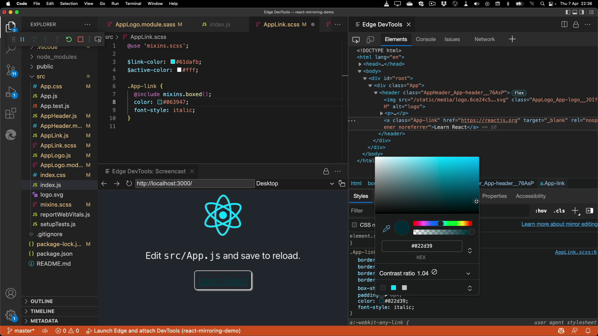

# Demo app to test sourcemap support of the VS Code Edge DevTools extension

This is a basic app to test the sourcemap support for CSS mirroring in [the Edge DevTools extension for Visual studio code](https://aka.ms/devtools-for-code).

To run the app and test the functionality follow these steps:

1. Make sure you have the Microsoft Edge DevTools for Visual Studio Code extension installed
1. Clone this repo or [download the zip](demo.zip) of this app and unpack it</li>
1. Open the folder in Visual Studio Code
1. Run `npm i` in the Terminal
1. Run `npm start` in the Terminal
1. Switch VS Code to "Run and Debug" and run "Launch Edge and Attach DevTools" (the project is already configured to use [Edge Canary](https://www.microsoftedgeinsider.com/download/canary), just make sure you have it installed)
1. Start editing Styles in DevTools and watch them sync!

We have an [issue open in the Extension repository](https://github.com/microsoft/vscode-edge-devtools/issues/965) and we'd love to get your feedback there!
