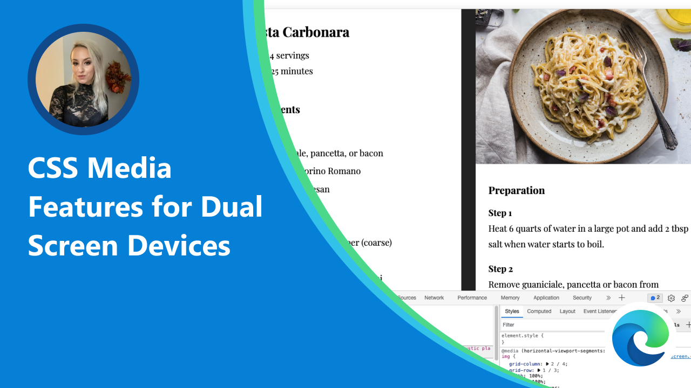

# Microsoft Edge web dev videos

Discover, and learn about new Microsoft Edge web development technologies and products such as DevTools, web platform APIs and features, and Progressive Web Apps.

This video series is meant to be a quick and entertaining way to learn about new things. Videos are all under 10 minutes, they're focused on just one feature, and contain demos.

We publish new videos on a regular basis on the [Microsoft Edge YouTube channel](https://www.youtube.com/channel/UCIGx7oT8p6-jUpOfg98yelA), and they are also listed below.

## Video title goes here

**04-12-2022** Description of the video goes here, including links to documentation, demo files, etc.

<!-- The entry below is just an example -->

## CSS Media Features for Dual Screen Devices

**04-05-2022** Stephanie Stimac talks about design and development considerations for dual screen devices, and how DevTools can help you. Learn more about [emulating dual screen and foldable devices](https://docs.microsoft.com/microsoft-edge/devtools-guide-chromium/device-mode/dual-screen-and-foldables).
