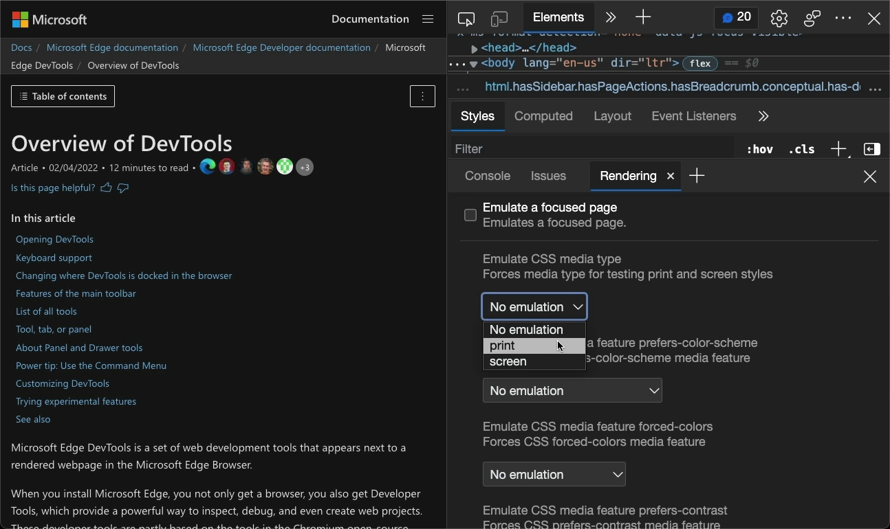
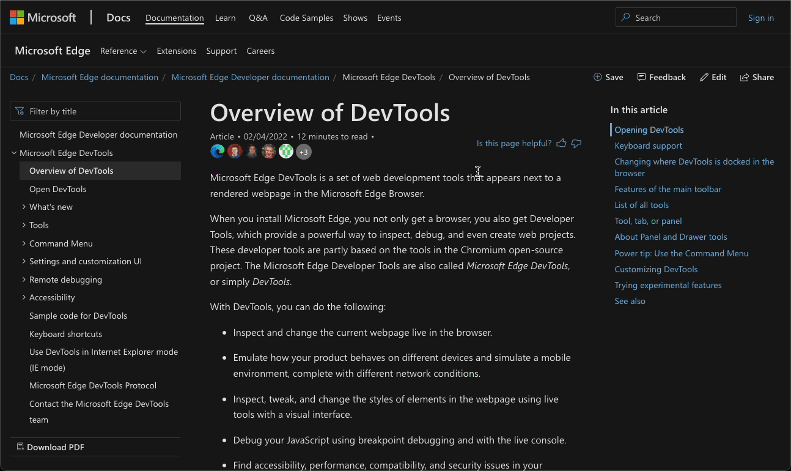

# Debugging print layout without wasting paper

## Tip message

Saving a 🌳: If you want to see what your web product looks like when printed you can use the print mode emulation in the Rendering tool of @EdgeDevTools.
Learn more: https://docs.microsoft.com/microsoft-edge/devtools-guide-chromium/css/print-preview

## Read more

* DevTools Print Preview: https://docs.microsoft.com/microsoft-edge/devtools-guide-chromium/css/print-preview

## Media  

* [Preview Image](media/print-preview.png)

* [GIF](media/print-preview.gif)

* [Video](media/print-preview.mp4)