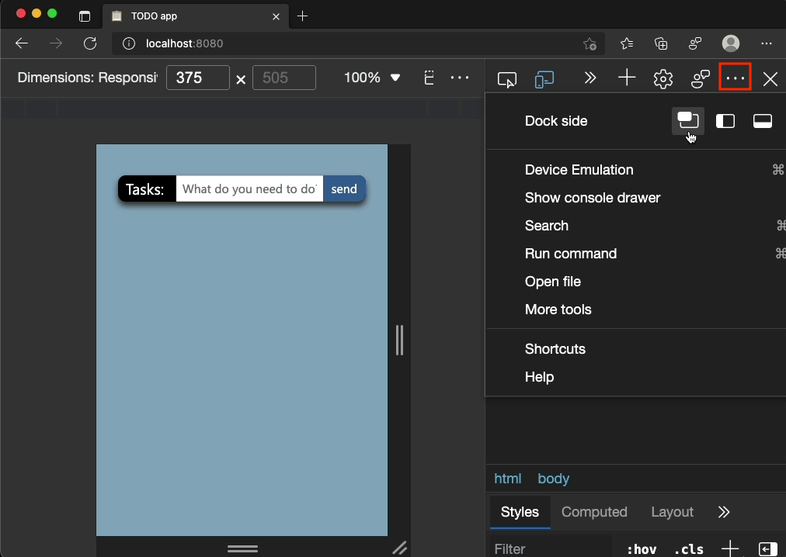
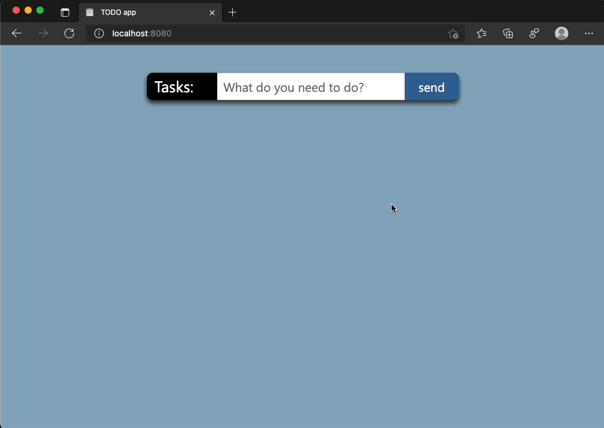

# Use device emulation in a full browser window

## Tip message

A lot of people want to test their web products in a mobile emulation without DevTools taking up screen space. You can undock the tools into an own window using the … menu. This gives you the full browser as an emulation playground.

## Read more 
* DevTools placement: https://docs.microsoft.com/microsoft-edge/devtools-guide-chromium/customize/placement 
* Device Emulation: https://docs.microsoft.com/microsoft-edge/devtools-guide-chromium/device-mode/

## Media  

* [Preview Image](media/use-device-emulation-in-full-window.png)

* [GIF](media/use-device-emulation-in-full-window.gif)

* [Video](media/use-device-emulation-in-full-window.mp4)