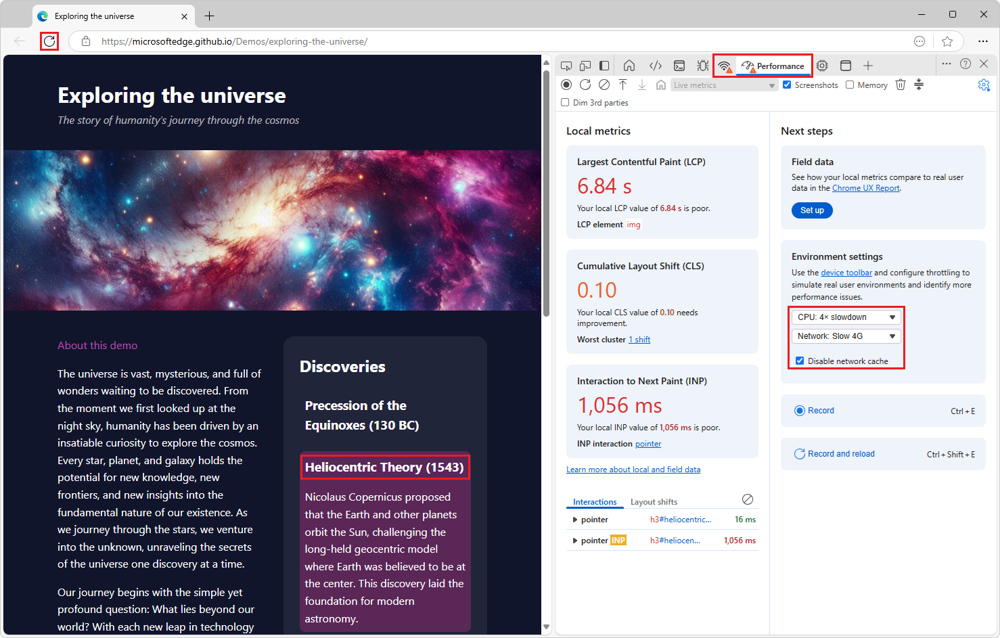

# Exploring the universe demo

➡️ **[Open the demo](https://microsoftedge.github.io/Demos/exploring-the-universe/)** ⬅️

The webpage in this directory is a demo for the [Monitor Core Web Vitals metrics](https://learn.microsoft.com/microsoft-edge/devtools-guide-chromium/performance/overview#monitor-core-web-vitals-metrics) section of the [Performance tool: Analyze your website's performance](https://learn.microsoft.com/microsoft-edge/devtools-guide-chromium/performance/overview) article in the Microsoft Edge DevTools documentation.

That article is not live yet, but a draft is in [PR 3378](https://github.com/MicrosoftDocs/edge-developer/pull/3378); see the GitHub preview of [Performance tool: Analyze your website's performance](https://github.com/MicrosoftDocs/edge-developer/blob/user/mikehoffms/perf-sync/microsoft-edge/devtools-guide-chromium/performance/overview.md#observe-core-web-vitals-live).

This webpage is designed to load and handle interactions slowly on purpose, in order to illustrate how the LCP, CLS, and INP metrics can be used in the Performance tool to identify and fix performance issues.

Use the **Performance** tool to view Core Web Vitals metrics in the initial, **Local metrics** view.  The home page of the **Performance** tool shows **Local metrics**, which is performance metrics about the rendered webpage:

* **Largest Contentful Paint (LCP)** - How quickly the main content of the page loaded.
* **Cumulative Layout Shift (CLS)** - A measure of the most recent unexpected page layout shift.
* **Interaction to Next Paint (INP)** - The responsiveness of the most recent user interaction on the page.

<!-- ====================================================================== -->
## Using the demo page

To produce a **poor** or **needs improvement** metric on the three metrics cards in the **Performance** tool:

1. Open the **Exploring the universe** demo page.

1. Right-click the demo page, and then select **Inspect**.

   DevTools opens.

1. In the **Activity Bar** at top, select the **Performance** tool.

1. Make the demo page pane wide, such as 60% of the width of the window.

   If the demo page pane is too narrow, some cards might continue showing **good**, with a green value, which is not the intended result.

1. Optional, but recommended: Select **Next steps** pane > **Environment settings** card > **CPU throttling** dropdown > select **4x slowdown - recommended**.

1. Optional, but recommended: Select **Next steps** pane > **Environment settings** card > **Network throttling** dropdown > select **Slow 4G**.

1. Optional, but recommended: Select **Next steps** pane > **Environment settings** card > select the **Disable network cache** checkbox.

   

1. Right-click (or long-click) the **Refresh** button to the left of the **Address bar**, and then select **Empty cache and hard refresh**.

   This ensures that the image is loaded again from the server, rather than from the local cache.

   The **LCP** and **CLS** cards show an orange value and **needs improvement**, or a red value and **poor**, instead of a green value and **good**.

1. If the **LCP** or **CLS** card remains green and says **good** after the stars image finishes rendering, make the demo page pane wider.

   The **LCP** card shows that the image took a long time to load.  The card shows an orange value and **needs improvement**, or a red value and **poor**, instead of a green value and **good**.  The engine identifies this image of stars as the largest item to be rendered.

   The **CLS** card illustrates that sudden, unexpected jumps in the layout can negatively impact users.  This is also due to the image taking some time to load.  By design, the demo webpage neglects to specify a height for the image, and so the page initially loads without reserving much space for the image.  When the image starts appearing, the content below it suddenly jumps down.

1. After the stars image finishes rendering, in the rendered demo page, click an accordion item (an expanding heading) in the right-hand column, such as **Heliocentric Theory (1543)**.

   The **INP** card changes from not showing a value, to showing an orange value and **needs improvement**, or a red value and **poor**.  An **INP** value is displayed.

1. In the **INP** card, click the INP value.

   In the demo page, the **Discoveries** cards are designed to expand and re-render slowly, so that it takes a long time between clicking the heading and rendering the expanded card content.  The delay is a random value between 100ms and 1000ms, resulting in a high INP value.