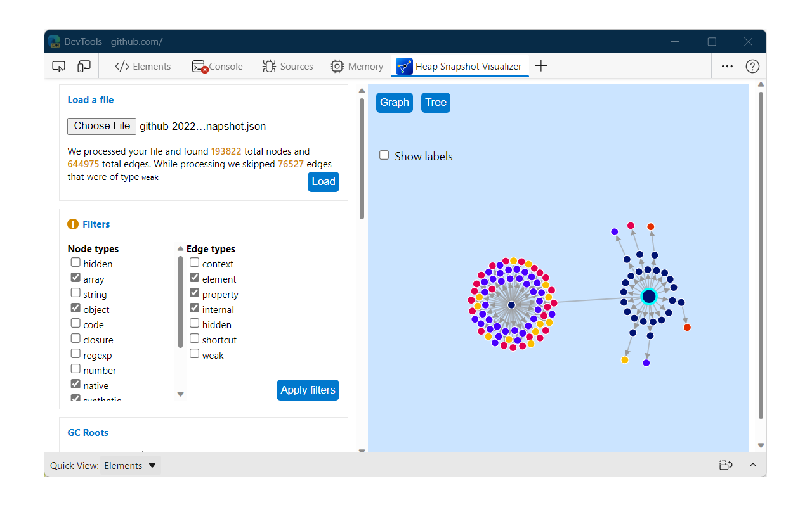

# Heap snapshot visualizer

A DevTools extension to show a visualization of the contents of a `*.heapshapshot` file.

_* This extension is under development_

## What is a heap snapshot file?

Please refer to this document which contains all the information you need to udnerstand the schema of a`*.heapspanshot` file produced by the DevTools Memory tool: [The heap snapshot file format](https://learn.microsoft.com/en-us/microsoft-edge/devtools-guide-chromium/memory-problems/heap-snapshot-schema)

## What kind of visualization?
- A force directed graph
- A tree

## What can I do with it?
- Filter nodes
- Explore the memory structure starting from GC retainers
- Isolate the retainer chain for a single node using its object id 

## Dependencies
This extension uses React and D3

## How to Install and Build
This is a project that uses Typescript and React, you need to build it in order to get the outputs needed for the extension.

`npm install`

`npm run build`

## Load
1) Open the Edge browser
2) Navigate to `edge://extensions`
3) Enable Developer Mode
4) Click "Load unpacked" and select the `build` folder
5) Navigate to a site and open DevTools
6) Find *Heap Snapshot Visualizer* as a tab.

## This is how it looks like
