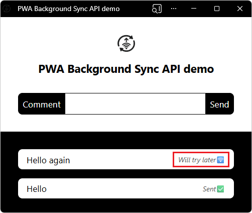

# PWA Background Sync API demo

<!-- ====================================================================== -->
## Open the sample

To test the demo app:

1. Open the [PWA Background Sync API demo](https://microsoftedge.github.io/Demos/pwa-background-sync/).

1. In the Address bar, click the **App available** button.

   The app is installed.

1. Open the installed app in its own window.

<!-- ====================================================================== -->
## About the sample

The Background Sync API makes it possible for users to continue using your PWA even when they are offline, and synchronize data with the server once the network connection is restored.

The PWA Background Sync API demo lets you send chat messages even when offline.  If you're offline when sending a message, the app uses Background Sync to send the message later, when you're back online.

The PWA Background Sync API demo uses the following features:

| Feature | Description | Documentation |
|---|---|---|
| Background Sync | Enables using the PWA when offline; synchronizes data with the server when the network connection is restored. | [Synchronize and update a PWA in the background](https://learn.microsoft.com/microsoft-edge/progressive-web-apps/how-to/background-syncs) |

<!-- ====================================================================== -->
## See also

* [Use the Background Sync API to synchronize data with the server](https://learn.microsoft.com/microsoft-edge/progressive-web-apps/how-to/background-syncs#use-the-background-sync-api-to-synchronize-data-with-the-server) in _Synchronize and update a PWA in the background_.
