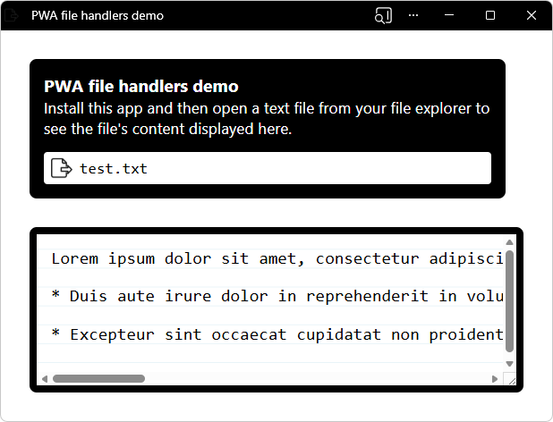

# PWA file handlers demo

<!-- ====================================================================== -->
## Open the sample

To open this sample:

1. Go to [PWA file handlers demo](https://microsoftedge.github.io/Demos/pwa-file-handlers/).

1. In the Address bar, click the **App available** button.

1. Open the installed app in its own window.

<!-- ====================================================================== -->
## About the sample

The PWA file handlers app handles `*.txt` files like a native application does, by using the `file_handlers` web app manifest member.

The PWA file handlers demo uses the following features:

| Feature | Description | Documentation |
|---|---|---|
| File Handling | The `file_handlers` web app manifest member enables a PWA to handle file types like a native application does. | [Handle files in a PWA](../how-to/handle-files.md) |
