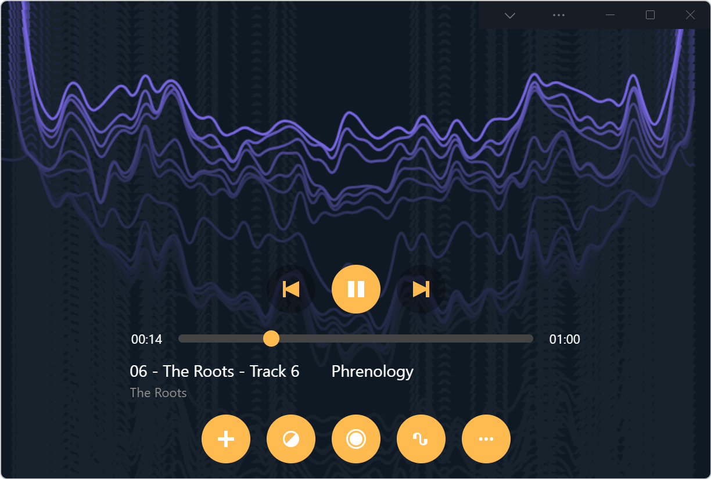

# PWAMP app demo

PWAMP is a web audio player demo application. It is an installable web app that's great to use on a desktop or laptop computer.

## User guide

* Open the app: https://microsoftedge.github.io/Demos/pwamp/
* Drag and drop audio files from your explorer onto the playlist area (or hit the `+` button).

## Making a new skin

A skin is a CSS file that gets applied to the app, replacing the default CSS.

The best way to make a new skin is to open DevTools and look at the HTML structure of the page. Most elements should have handy classes and IDs that will make them easy to style.

Skins are expected to have a `:root {}` rule with at least one variable called `--back` set to the color of the background. This will be used at runtime, in JavaScript, by the app to apply the color to the visualizer and the title bar area.

## What does the name mean?

[Winamp](https://en.wikipedia.org/wiki/Winamp) was a very successful media player application for Microsoft Windows. PWAMP's name was inspired by it, we just replaced the `win` part with `PWA` which stands for [Progressive Web App](https://docs.microsoft.com/microsoft-edge/progressive-web-apps-chromium/). We decided not to name it webamp (which might have made more sense) because [webamp already exists](https://webamp.org/).

You can think of this as the Progressive Web Amp.

## TODO

* Add current song playing info in player.
* Add the ability to drag/drop songs in the playlist to re-order them.
* Make use of PWA features to make it a great desktop experience:
  * Shortcuts (caveat: shortcuts launch a new instance, and can't autoplay music since this requires user interaction, so not sure what to use this for).
  * Web Widgets
* Submit to the store.
* Ability to export as another file format.
* Use viewport segments to display on dual screen devices.
* Add repeat and shuffle buttons.
* Add keyboard shortcuts to play/pause/prev/next/visualize/focus playlist/...
* Default skin needs to better handle very wide windows, make use of all the empty space.
* Artwork support.
