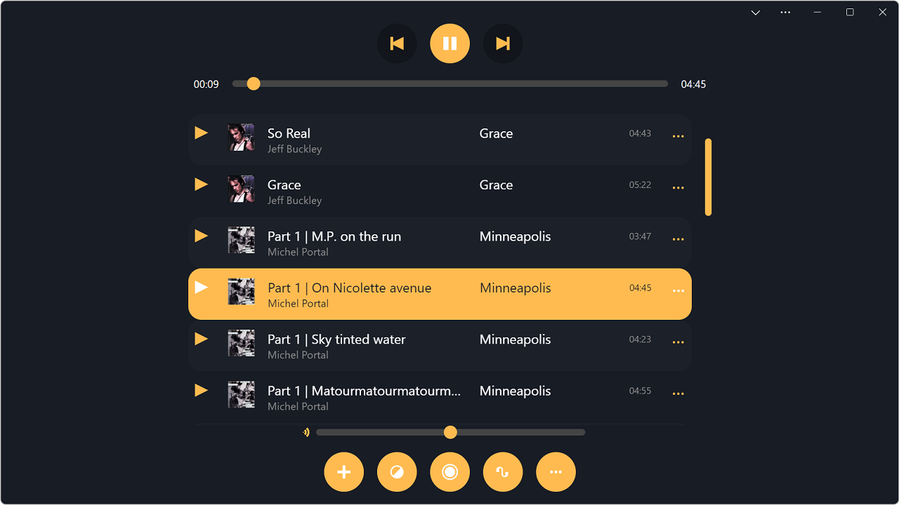

# PWAmp app demo

➡️ **[Open the demo](https://microsoftedge.github.io/Demos/pwamp/)** ⬅️

PWAmp (pronounced P-W-Amp) is a web audio player demo application. It is an installable web app (PWA) specifically made to demonstrate desktop-integration features.

## User guide

* Open the app: https://microsoftedge.github.io/Demos/pwamp/
* To add new songs:
  * Either drag and drop audio files from your explorer onto the playlist area.
  * Or click the `+` button in the bottom toolbar.
* Artist, title, and album information are parsed from the song files (if available).
* To edit song information, click on the artist, title, or album fields and edit the text.
* To add custom artworks for albums, drag and drop image files onto songs.
* Use the top toolbar to play, pause, and go to the next or previous songs.
* The bottom toolbar contains the following extra features:
  * Apply a custom skin: select a .css or .pwampskin file to replace the look and feel of the app with your own.
  * Record an audio clip: click once to start recording, click once more to stop recording.
  * Show visualizer: click to toggle the visualizer mode.
  * More tools: options to download all songs or delete all songs.
* If you install the PWA locally on desktop, the following features become available:
  * Audio files are handled natively. Just double-click an audio file to add it to your PWAmp library.
  * *.pwampskin files are also handled natively, Double-click one such file to change the look and feel of the app.
  * The custom `web+amp` protocol is handled natively. Share links of remote songs with other people by using `web+amp:remote-song:<url-to-song>` links. You can also share skins with other people by using `web+amp:skin:<url-to-skin>`.
    [Example song link](web+amp:remote-song:ia803003.us.archive.org/17/items/78_by-the-light-of-the-silvery-moon_fats-waller-and-his-rhythm-fats-waller-the-dee_gbia0153541a/BY%20THE%20LIGHT%20OF%20THE%20SILVERY%20-%20%22Fats%22%20Waller%20and%20his%20Rhythm.mp3)
  * The title bar becomes toggleable. Click the chevron icon in the toolbar to hide it.
  * The app becomes a share target for audio files. If you share audio files from another app (or from the explorer), PWAmp is displayed as a target app for these files.

## Making a new skin

A skin is a CSS file that gets applied to the app, replacing the default CSS.

The best way to make a new skin is to open DevTools and look at the HTML structure of the page. Most elements should have handy classes and IDs that will make them easy to style.

Skins are expected to have a `:root {}` rule with at least one variable called `--back` set to the color of the background. This will be used at runtime, in JavaScript, by the app to apply the color to the visualizer and the title bar area.

## What does the name mean?

[Winamp](https://en.wikipedia.org/wiki/Winamp) was a very successful media player application for Microsoft Windows. PWAmp's name was inspired by it, we just replaced the `win` part with `PW` which are the 2 first letters of PWA (which stands for [Progressive Web App](https://learn.microsoft.com/microsoft-edge/progressive-web-apps-chromium/)). The name Webamp might have made more sense but was [already used](https://webamp.org/).

You can think of this app as the "Progressive Web Amp".

## Song credits

The first time you open the app, a few songs are pre-loaded. These are remote URL songs, so they will only play when you are online.

Credits for those songs:

* "Reunion", and "Over The Stargates" by David Rousset, used with the author's approval. More information and songs on [soundcloud](https://soundcloud.com/david-rousset).
* "Opening" and "Aloe-Almond Butter And Space Pesto" by Noi2er, from the [Internet Archive](https://archive.org/details/DWK382).

## TODO

* Make sure the app is accessible in high-contrast mode.
* Make it possible to download remote songs locally (fetch -> readablestream -> store chunks in IDB. And then fetch handler in SW to serve these chunks back from IDB when offline).
* Improve song adding performance again: only get duration later, after song has been added.
* Add the ability to drag/drop songs in the playlist to re-order them.
* Ability to export as another file format.
* Use viewport segments to display on dual screen devices.
* Add repeat and shuffle buttons.