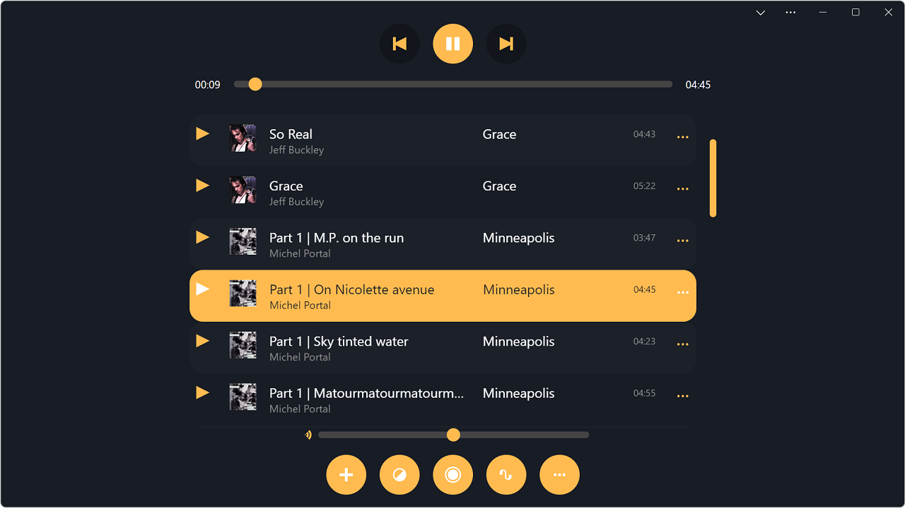

# PWAmp app demo

**Contents:**
* [Open the sample](#open-the-sample)
* [About the sample](#about-the-sample)
   * [About the name "PWAmp"](#about-the-name-pwamp)
   * [Features available by installing the app](#features-available-by-installing-the-app)
   * [Features demonstrated](#features-demonstrated)
* [Use the sample](#use-the-sample)
   * [Add new songs](#add-new-songs)
   * [Edit song information](#edit-song-information)
   * [Add custom artwork for an album](#add-custom-artwork-for-an-album)
   * [Play, pause, or go to the next or previous song](#play-pause-or-go-to-the-next-or-previous-song)
   * [Record an audio clip](#record-an-audio-clip)
   * [Show the visualizer](#show-the-visualizer)
   * [Download all songs](#download-all-songs)
   * [Delete all songs](#delete-all-songs)
   * [Make a custom skin](#make-a-custom-skin)
   * [Apply a custom skin](#apply-a-custom-skin)
* [Song credits](#song-credits)
* [Possible enhancements](#possible-enhancements)
* [Articles that use this demo](#articles-that-use-this-demo)

<!-- ====================================================================== -->
## Open the sample

1. Go to the [pwamp](https://microsoftedge.github.io/Demos/pwamp/) demo in a new window or tab.

1. In the Address bar, click the **App available** button.

1. Open the installed app in its own window.

<!-- ====================================================================== -->
## About the sample

PWAmp is pronounced _P-W-Amp_.

PWAmp is a web audio player demo app; a desktop music player that plays local and remote audio files.

The app is an installable Progressive Web App (PWA) specifically made to demonstrate desktop integration features.

<!-- ------------------------------ -->
### About the name "PWAmp"

This app is a "Progressive WebAmp".  PWAmp's name was inspired by [Winamp](https://en.wikipedia.org/wiki/Winamp), which was a popular media player application for Microsoft Windows.

The "Win" part of the name "WinAmp" was replaced by "PW", which are the first two letters of "PWA" (Progressive Web App).

The name "Webamp" was already in use, by [Webamp.org](https://webamp.org).

See also:
* [Overview of Progressive Web Apps (PWAs)](https://learn.microsoft.com/microsoft-edge/progressive-web-apps/)

<!-- ------------------------------ -->
### Features available by installing the app

When you install the PWA locally on the desktop, the following features become available:

* Audio files are handled natively.  To add an audio file to your PWAmp library, double-click the audio file, such as in File Explorer.

* `*.pwampskin` files are handled natively.  To change the look and feel of the app, double-click a `.pwampskin` file.

* The custom `web+amp` protocol is handled natively.

   * Share links of remote songs with other people by using `web+amp:remote-song:<url-to-song>` links.

   * You can also share skins with other people by using the URL pattern `web+amp:skin:<url-to-skin>`.  Example song link: 

      * [By the Light of the Silvery Moon - Fats Waller](web+amp:remote-song:ia803003.us.archive.org/17/items/78_by-the-light-of-the-silvery-moon_fats-waller-and-his-rhythm-fats-waller-the-dee_gbia0153541a/BY%20THE%20LIGHT%20OF%20THE%20SILVERY%20-%20%22Fats%22%20Waller%20and%20his%20Rhythm.mp3).

* The title bar can be displayed or hidden.  To hide the title bar, in the toolbar, click the chevron (^) icon.

* The app becomes a share target for audio files.  If you share audio files from another app (or from the explorer), PWAmp is displayed as a target app for these files.

<!-- ------------------------------ -->
### Features demonstrated

PWAmp uses the following features:

| Feature | Description | Documentation |
|---|---|---|
| Window Controls Overlay | The space normally reserved to the title bar can be used by PWAmp to display a visualization of the current song. | [Display content in the title bar area using Window Controls Overlay](../how-to/window-controls-overlay.md) |
| Protocol Handling | Links that start with `web+amp:` can be used to share remote songs. | [Handle protocols in a PWA](../how-to/handle-protocols.md) |
| File Handling | Audio files can be opened with PWAmp directly. Right-click on a file ending with `.mp3` for example and click **Open with**. | [Handle files in a PWA](../how-to/handle-files.md) |
| Web Share | Songs can be shared with other apps through the operating system sharing dialog. | [Sharing content](../how-to/share.md#sharing-content) |
| Share Target | Other apps can share audio files with PWAmp, through the operating system sharing dialog. | [Receiving shared content](../how-to/share.md#receiving-shared-content) |
| Widget | A mini-player Widget can be installed in Windows 11 Widgets dashboard to see the current song. | [Display a PWA widget in the Windows Widgets Board](../how-to/widgets.md) |
| Sidebar | PWAmp can be pinned to the sidebar in Microsoft Edge. | [Build a PWA for the sidebar in Microsoft Edge](../how-to/sidebar.md) |

<!-- ====================================================================== -->
## Use the sample

<!-- ------------------------------ -->
### Add new songs

To add new songs, do either:
* Drag audio files from your explorer onto the playlist area.
* In the bottom toolbar, click the `+` button.

Artist, title, and album information are parsed from the song files (if available).

<!-- ------------------------------ -->
### Edit song information

To edit song information:

1. Click the artist, title, or album field.

1. Edit the text.

<!-- ------------------------------ -->
### Add custom artwork for an album

To add custom artwork for an album:

1. Drag and drop an image file onto a song.

<!-- ------------------------------ -->
### Play, pause, or go to the next or previous song

To play, pause, or go to the next or previous song:

1. Use the top toolbar.

<!-- ------------------------------ -->
### Record an audio clip

To record an audio clip:

1. Click the **Record an audio clip** button at the bottom of the page.

1. Click the **Stop recording** button at the bottom of the page.

<!-- ------------------------------ -->
### Show the visualizer

To show or hide the visualizer:

1. Click the **Show visualizer** button in the upper right of the page.

   The page UI is replaced by the visualizer.

1. Click the **Stop visualizer** button in the lower right of the page.

<!-- ------------------------------ -->
### Download all songs

To download all songs:

1. Click the **More tools** button in the lower right of the page, and then select **Export all**.

   The first track starts playing.

1. Click the **more options** button, and then select **Download**.

<!-- ------------------------------ -->
### Delete all songs

To delete all songs:

1. Click the **More tools** button in the lower right of the page, and then select **Delete all**.

<!-- ------------------------------ -->
### Make a custom skin

A skin is a CSS file that gets applied to the app, replacing the default CSS.

The best way to make a new skin is to open DevTools and look at the HTML structure of the page.  Most elements should have handy classes and IDs that will make them easy to style.

Skins are expected to have a `:root {}` rule with at least one variable called `--back` set to the color of the background.  The `:root {}` rule is used at runtime, via JavaScript, to apply the color to the visualizer and the title bar area.

<!-- -------------- -->
#### Apply a custom skin

To replace the look and feel of the app with your own look and feel:

1. Click the **Apply a custom skin** button at the bottom of the page.

   The **Select a file this site can read** dialog opens.

1. Select a `.css` or `.pwampskin` file.

<!-- ====================================================================== -->
## Song credits

The first time you open PWAmp, a few songs are pre-loaded.  These songs use remote URLs.  These songs only play when you are online.

Credits for the pre-loaded songs:

* "Reunion", and "Over The Stargates" by David Rousset, used with the author's approval. More information and songs on [soundcloud](https://soundcloud.com/david-rousset).
* "Opening" and "Aloe-Almond Butter And Space Pesto" by Noi2er, from the [Internet Archive](https://archive.org/details/DWK382).

<!-- ====================================================================== -->
## Possible enhancements<!-- todo -->

* Make sure the app is accessible in high-contrast mode.

* Make it possible to download remote songs locally:
   * Fetch, then `readablestream`, then store chunks in IDB.
   * Then fetch handler in SW to serve these chunks back from IDB when offline.

* Improve song adding performance again: only get duration later, after song has been added.

* Add the ability to drag songs onto the playlist to re-order them.

* Add the ability to export a song as a different file format.

* Use viewport segments to display on dual-screen devices.

* Add **Repeat** and **Shuffle** buttons.

<!-- ====================================================================== -->
## Articles that use this demo

Find "PWAmp" in the following articles.

* [PWAmp](https://learn.microsoft.com/microsoft-edge/progressive-web-apps/samples/index#pwamp) in _Progressive Web App samples_.
* [Console features reference](https://learn.microsoft.com/microsoft-edge/devtools/console/reference)
* [Test Progressive Web App (PWA) protocol handling](https://learn.microsoft.com/microsoft-edge/devtools/progressive-web-apps/protocol-handlers)
* [View and change IndexedDB data](https://learn.microsoft.com/microsoft-edge/devtools/storage/indexeddb)
* [Best practices for PWAs](https://learn.microsoft.com/microsoft-edge/progressive-web-apps/how-to/best-practices)
* [Automatic link handling](https://learn.microsoft.com/microsoft-edge/progressive-web-apps/how-to/handle-urls#automatic-link-handling) in _Handle links to a PWA_.
* [Demo of sharing content](https://learn.microsoft.com/microsoft-edge/progressive-web-apps/how-to/share#demo-of-sharing-content) in _Share content with other apps_.
* [Build a PWA for the sidebar in Microsoft Edge](https://learn.microsoft.com/microsoft-edge/progressive-web-apps/how-to/sidebar)
* [Display a PWA widget in the Windows Widgets Board](https://learn.microsoft.com/microsoft-edge/progressive-web-apps/how-to/widgets)
* [What's New in PWAs](https://learn.microsoft.com/microsoft-edge/progressive-web-apps/whats-new/pwa)
