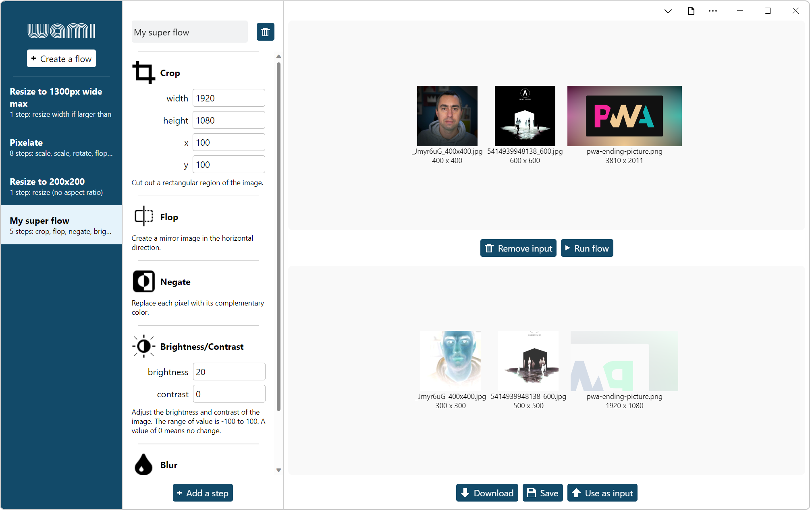

# wami, the Web App to Manipulate Images

➡️ **[Open the demo](https://microsoftedge.github.io/Demos/wami/)** ⬅️

wami is an image manipulation demo application. It is an installable web app (PWA) specifically made to demonstrate that web technologies can be used to create desktop apps that feel like platform-specific apps.

wami is under development; expect bugs and cross-browser compatibility issues.

<!-- ====================================================================== -->
## Using the demo

1. Open the app.

1. Click on one of the pre-defined flows in the left sidebar, or create a new one from scratch by clicking **Create a flow**.

1. When a flow is opened, you can:
   * Rename the flow by typing in the flow name textfield.
   * Delete the flow by clicking the delete icon next to the flow name.
   * Add new flow steps by clicking **Add a step**.
   * Re-order steps by dragging them in the list of steps.
   * Change the parameters of steps.
   * Delete a step by clicking on the delete icon while hovering on a step.

To run a flow:

1. Drag images from your computer and drop them in the drop area (or click **browse** to select them with the operating system file picker).

1. Click **Run flow**. The images are processed based on the defined steps and the resulting images appear in the bottom area.

To download processed images:

1. Click **Download** to save the images to your **Downloads** folder.

1. Click **Save** to save the images back to their original locations (**this will override the files on disk**).

To use other input images:

* Drag new images on the drop area at the top.  Or, click **Remove input**.

* You can also click **Use as input** to use the processed images as input images.

<!-- ====================================================================== -->
## Libraries used

The app uses the [WASM-ImageMagick](https://github.com/KnicKnic/WASM-ImageMagick) library to process images in a worker thread.

<!-- ====================================================================== -->
## TODO

Possible enhancements for this demo:

* Add a `file_handlers` manifest member to handle images.
* Categorize steps and add a way to search through them.
* Share images.
* Export/import flows as JSON files.
* Submit this demo to the Microsoft store.
